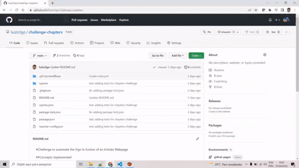
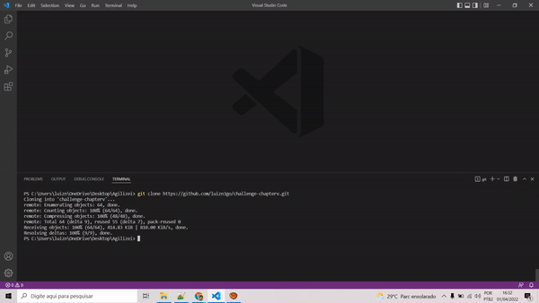
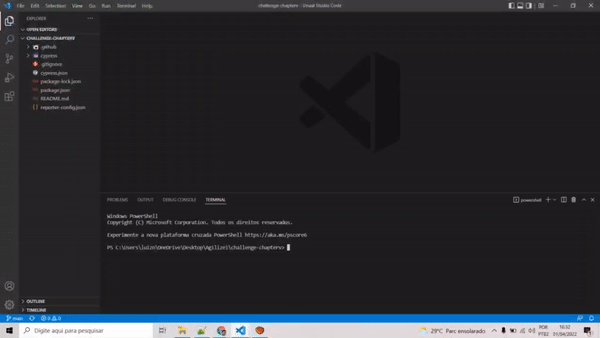
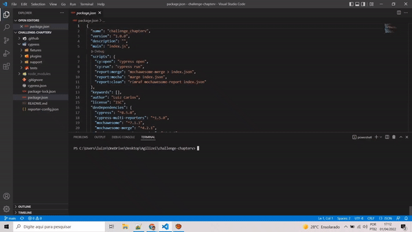
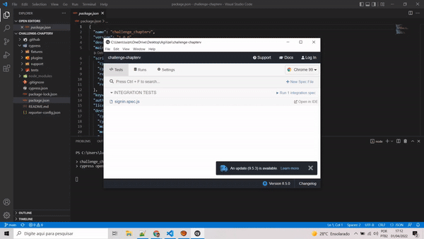

# Challenge to automate the Sign In feature of an articles webpage
## Concepts implemented
- Page Objects
- UI and E2E testing
- API
## Technologies
- [Cypress]
- [Node.js]
- [JavaScript]
## How to run project 
1. Clone repository 
    1. Go to Code option in project's page
    2. Copy the URL: "https://github.com/luizn3go/challenge-chapterv.git"
    3. Run: "git clone https://github.com/luizn3go/challenge-chapterv.git"

2. Go to project's folder

3. Run: "npm install" to install project's dependencies 

4. Run: "npm run cy:open" to open cypress

5. Select "signin.spec.js" to run the tests

6. You can also run it using GitHub Actions going to below options:
    1. Actions
    2. ci
    3. Run workflow
    4. Report will be available at: https://luizn3go.github.io/challenge-chapterv/

   [JavaScript]: https://www.javascript.com/
   [Node.js]: https://nodejs.org/en/
   [Cypress]: https://www.cypress.io/

